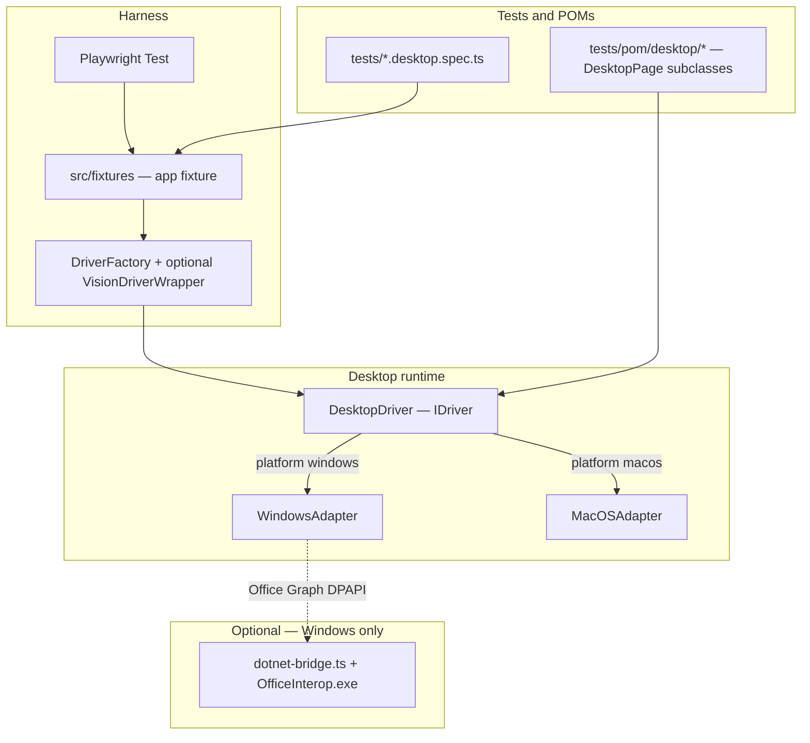

# Desktop stack (architecture)

Desktop tests use one **`DesktopDriver`** façade. Behind it, **`metadata.platform`** (`macos` or `windows`, from Playwright project config or `@platform=` title tag) selects a **platform adapter** that implements the same logical operations (connect to app, read UI tree, send input, capture screenshots) using **OS-native APIs**.

This page answers: **who calls whom**, **what file owns what**, and **why** we split macOS vs Windows vs optional .NET.

**User-facing guides:** [macOS](../desktop/macos.md) · [Windows](../desktop/windows.md) · [Windows from zero](../desktop/windows-automation-from-zero.md) · [.NET sidecar](../desktop/dotnet-sidecar.md) · [MCP bridge](../desktop/mcp-bridge.md)

**Diagram in overview:** [§13.2 Desktop](../architecture/overview.md#132-desktop-macos--windows)

---

## 1. High-level picture

---

## 2. Responsibilities by layer

| Layer                 | Type / file                                   | Responsibility                                                             |
| --------------------- | --------------------------------------------- | -------------------------------------------------------------------------- |
| **Test / POM**        | `tests/**`                                    | Business scenarios; call **`IDriver`** only                                |
| **Fixture**           | `src/fixtures/index.ts`                       | Build driver from **project metadata**; **auto-launch** and **auto-close** |
| **Factory**           | `src/core/driver-factory.ts`                  | Instantiate **`DesktopDriver`**; optionally wrap with **vision**           |
| **Façade**            | `src/drivers/desktop/desktop-driver.ts`       | Route **`click`**, **`fill`**, **`getElements`**, … to the active adapter  |
| **Adapter (macOS)**   | `src/drivers/desktop/macos-adapter.ts`        | AppleScript / System Events / Accessibility                                |
| **Adapter (Windows)** | `src/drivers/desktop/windows-adapter.ts`      | UIA + PowerShell; optional **sidecar** RPC for Office/Graph/DPAPI          |
| **POM base**          | `src/drivers/desktop/pom/desktop-page.ts`     | **`DesktopPage`** extends shared **`DriverPage`**                          |
| **Vision**            | `src/vision/*`                                | Screenshot + LLM locate/describe; PID-aware bounds                         |
| **Sidecar**           | `sidecar/OfficeInterop/*`, `dotnet-bridge.ts` | **Optional** isolated .NET process — not on critical path for UIA          |
| **MCP**               | `mcp/desktop-bridge.ts`                       | IDE/agent tools sharing adapters + vision                                  |

---

## 3. Why DesktopDriver + adapters (not one Windows class)

1. **Single test API** — `IDriver` keeps **`app.click(...)`** stable across macOS and Windows so POMs and patterns port.
2. **Swap by config** — `playwright.config.ts` metadata changes behavior **without** `#ifdef` in every spec.
3. **Contain OS entropy** — PowerShell quoting, UIA quirks, and COM lifetime rules stay inside **`WindowsAdapter`** / sidecar, not in tests.
4. **Testability** — smaller units (adapter vs driver vs vision) than one monolith.

---

## 4. macOS vs Windows (symmetric idea, different implementation)

### macOS

- **Adapter:** `MacOSAdapter`
- **Mechanisms:** Accessibility, AppleScript / System Events, process targeting
- **Typical selectors:** AX **role** + **label** / name strings surfaced in `getElements()`

### Windows

- **Adapter:** `WindowsAdapter`
- **Mechanisms:** UI Automation via **PowerShell** bridge in-repo, PID-based focus
- **Typical selectors:** UIA **Name**, **AutomationId**, etc., normalized into `UIElement`
- **Optional:** **`DotNetBridge`** spawns **`OfficeInterop.exe`** for COM/Graph/DPAPI only when called

---

## 5. POM layer

- **`DesktopPage`** extends **`DriverPage`** for shared ergonomics (desktop-oriented helpers, LLM judge hooks from base).
- **`DesktopBlock`** (where used) scopes selectors to regions (toolbar, panel).

**Reason:** Page objects **encode stable intent** (“save invoice”) while the adapter **maps intent to raw selectors** that may change per build.

---

## 6. MCP bridge vs Playwright

| Aspect         | Playwright + fixtures                          | MCP `desktop-bridge`             |
| -------------- | ---------------------------------------------- | -------------------------------- |
| **Purpose**    | Deterministic CI tests                         | Discovery, codegen, agent assist |
| **Lifecycle**  | Per test worker                                | Long-lived stdio server in IDE   |
| **Code reuse** | Same `WindowsAdapter` / `VisionProvider` types | Yes — single source of truth     |

---

## 7. Key source files

| File                                     | Role                                                      |
| ---------------------------------------- | --------------------------------------------------------- |
| `src/drivers/desktop/desktop-driver.ts`  | Chooses macOS vs Windows adapter; implements `IDriver`    |
| `src/drivers/desktop/macos-adapter.ts`   | macOS implementation                                      |
| `src/drivers/desktop/windows-adapter.ts` | Windows UIA/PowerShell + optional sidecar wrappers        |
| `src/drivers/desktop/dotnet-bridge.ts`   | stdio JSON client for `OfficeInterop.exe`                 |
| `sidecar/OfficeInterop/*`                | Optional .NET RPC server                                  |
| `src/drivers/desktop/pom/*`              | Desktop POM bases                                         |
| `mcp/desktop-bridge.ts`                  | MCP server (scan, elements, vision, POM, Office, secrets) |

---

## 8. Diagram (overview doc)

See **§13.2** in [**overview.md**](./overview.md#132-desktop-macos--windows) for the canonical platform diagram and glossary links.

---

[← Architecture hub](./README.md) · [Documentation home](../README.md)
