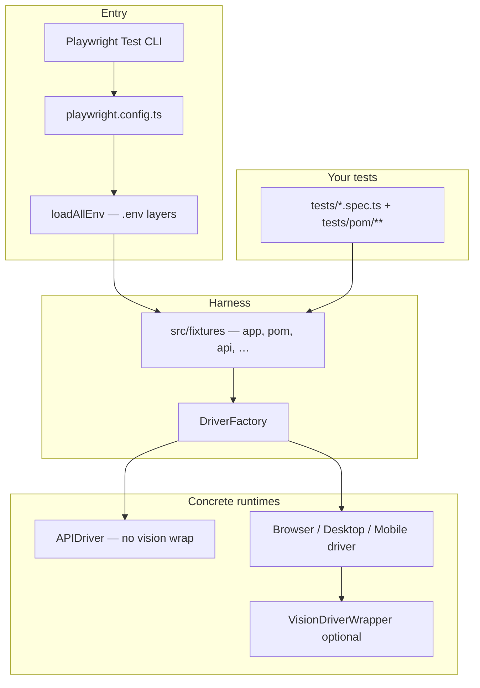
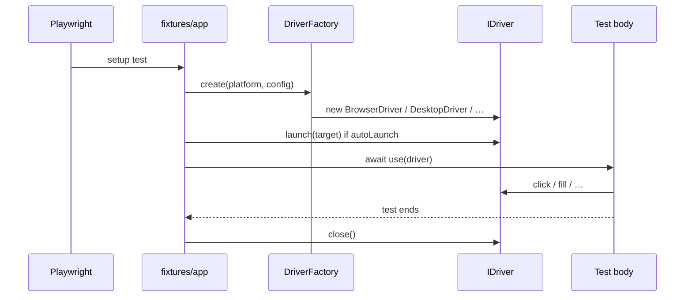
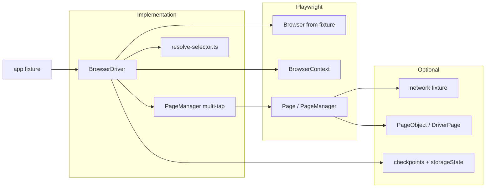
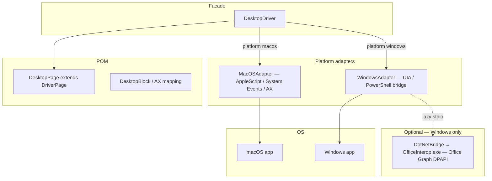
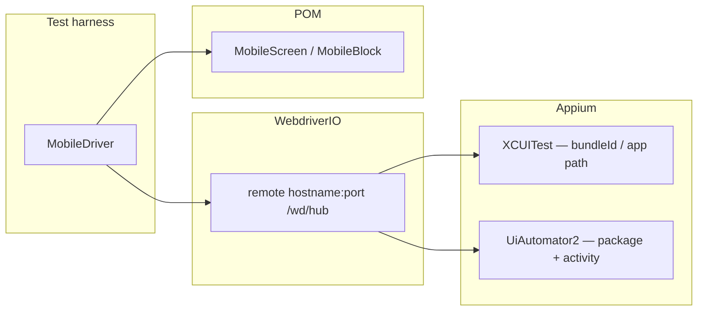
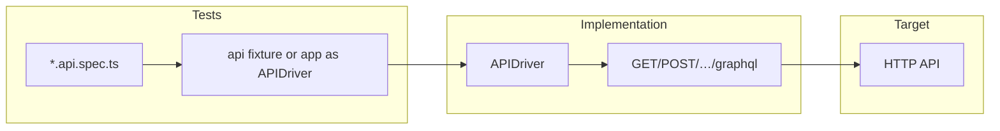

# Desktop Agent — System Architecture & Porting Guide

This document is the **top-level map** of the repository: what exists at each layer, **who calls whom**, what happens when you run a command, and how to **reuse or port** the design to another test framework (for humans and for AI assistants).

**Companion:** shared concepts that apply to every platform live in [**Common: fixtures & `IDriver`**](../common/fixtures-and-idriver.md).

---

## Table of contents

| #      | Section                                                                                                                        |
| ------ | ------------------------------------------------------------------------------------------------------------------------------ |
| 1      | [One-sentence mental model](#1-one-sentence-mental-model)                                                                      |
| 2      | [Layered architecture](#2-layered-architecture-who-sits-where)                                                                 |
| 3      | [End-to-end execution flow](#3-end-to-end-execution-flow)                                                                      |
| 4–12   | Core contracts, POM, LLM systems, config, porting, source map                                                                  |
| **13** | [**Platform runtime architectures (deep dive)**](#13-platform-runtime-architectures-deep-dive) — browser, desktop, mobile, API |
| 14     | [Glossary](#14-glossary)                                                                                                       |

---

## 1. One-sentence mental model

**Playwright Test** runs your specs; **`src/fixtures`** chooses a **platform** and builds an **`IDriver`** through **`DriverFactory`**; tests and page objects call **`IDriver`** methods (`click`, `fill`, `getElements`, …) regardless of whether the target is a browser tab, a native desktop app, or a mobile screen; optional **vision** wraps the driver for coordinate fallback; optional **LLM-as-judge** lives on **`DriverPage`** for structured assertions independent of platform.

### 1.1 System context (diagram)



---

## 2. Layered architecture (who sits where)

```text
┌─────────────────────────────────────────────────────────────────────────┐
│  tests/*.spec.ts          Your scenarios + assertions                   │
│  tests/pom/**             Page objects (screen-specific behavior)         │
├─────────────────────────────────────────────────────────────────────────┤
│  src/fixtures/index.ts    Playwright test.extend: builds fixtures         │
│       └── app             IDriver instance (auto launch + auto close)    │
│       └── pages           Browser-only: multi-tab PageManager           │
│       └── api             API-only: APIDriver                            │
│       └── auth, checkpoint  Cross-cutting helpers                       │
├─────────────────────────────────────────────────────────────────────────┤
│  src/core/driver-factory.ts                                               │
│       DriverFactory.create({ platform, browser?, config? })                │
│       └── May wrap with VisionDriverWrapper if vision key / config OK     │
├─────────────────────────────────────────────────────────────────────────┤
│  Concrete drivers (all implement IDriver)                                 │
│       BrowserDriver   → Playwright Browser / Context / Page               │
│       DesktopDriver   → MacOSAdapter | WindowsAdapter                     │
│       MobileDriver    → Appium / WebdriverIO path                         │
│       APIDriver       → HTTP client (fetch)                               │
├─────────────────────────────────────────────────────────────────────────┤
│  Platform adapters / browser internals                                    │
│       macOS: AppleScript + System Events / JXA-style element dump         │
│       Windows: UIA / PowerShell + optional .NET sidecar (Office Graph)   │
├─────────────────────────────────────────────────────────────────────────┤
│  src/pom/                                                                 │
│       ElementRef        Lazy actions: click/fill/wait on selector         │
│       DriverPage        Base for any IDriver-backed POM + LLM judge       │
│  src/drivers/desktop/pom/desktop-page.ts                                  │
│       DesktopPage       extends DriverPage (desktop-specific convenience)  │
├─────────────────────────────────────────────────────────────────────────┤
│  Optional: src/vision/                                                     │
│       VisionProvider    Screenshot → multimodal LLM (locate/describe)      │
│       VisionDriverWrapper Decorates IDriver: retry failed actions via vision│
├─────────────────────────────────────────────────────────────────────────┤
│  src/eval/                                                                  │
│       types.ts          Shared eval types: EvalLabel, JudgeRequest, etc.    │
│       llm-provider.ts   LlmProvider interface + OpenAI/Anthropic/Gemini    │
│       judge.ts          LlmJudge — prompt builder + JSON parser            │
│       rule-based.ts     Deterministic evaluators (JSON, domain, pattern)    │
│       eval-runner.ts    Alignment, bootstrap, self-consistency pipelines    │
├─────────────────────────────────────────────────────────────────────────┤
│  Configuration                                                             │
│       playwright.config.ts  Projects, testMatch, metadata per platform     │
│       src/core/env-loader.ts  .env + browser|desktop|mobile|api.env layers   │
│       src/core/config.ts      FrameworkConfig shape (typed config)           │
└─────────────────────────────────────────────────────────────────────────┘
```

---

## 3. End-to-end execution flow

### 3.1 You run tests

Example:

```bash
npx playwright test --project=desktop-macos
```

### 3.2 Playwright loads configuration

1. **`playwright.config.ts`** runs first.
2. It calls **`loadAllEnv()`** from **`src/core/env-loader.ts`**, which merges:
   - `.env` (common)
   - then `browser.env`, `api.env`, `desktop.env`, `mobile.env` if present  
     **Rule:** variables already set in the shell are **not** overwritten by files (shell wins).

### 3.3 Playwright selects a **project**

Each **project** defines:

- `testMatch` — which spec files run (e.g. `*.desktop.spec.ts`)
- `metadata` — **`platform`**, URLs, desktop app defaults, mobile bundle IDs, API base URL, etc.

So: **file name + project** together decide **macOS vs Windows vs Chrome**, not magic inside the spec.

### 3.4 Fixture creates the `app` driver

In **`src/fixtures/index.ts`**:

1. Reads **`testInfo.project.metadata.platform`** (unless overridden by tag `@platform=...` in the test title).
2. Calls **`DriverFactory.create({ platform, browser?, config: { …metadata slices… } })`**.
3. If **`autoLaunch`** is true, calls **`driver.launch(target)`**:
   - Browser: open context/page, optionally `goto(baseURL)`
   - Desktop: connect to process by **app name** from `@app=MyApp` tag or `DESKTOP_APP_NAME` / metadata
     - Default desktop launch state is `windowState: "maximized"` (override via `@windowState=...` or metadata / explicit launch option)
   - Mobile: bundleId / app package
   - API: “launch” = remember base URL
4. **`await use(driver)`** runs your test.
5. After the test, **`driver.close()`** always runs (cleanup).

### 3.5 Fixture lifecycle (sequence)



**Cause → effect (fixture):**

| You do                              | What happens                                           |
| ----------------------------------- | ------------------------------------------------------ |
| Name file `foo.desktop.spec.ts`     | Matched by desktop projects only                       |
| Add `@app=Calculator` in test title | Desktop launch targets that app name                   |
| Add `@platform=macos` in title      | Forces platform even if project name is ambiguous      |
| Omit `@app` and `DESKTOP_APP_NAME`  | Desktop launch may be skipped (`shouldLaunch = false`) |

---

## 4. The universal contract: `IDriver`

**File:** `src/core/base-driver.ts`

Every platform driver implements the same methods: **`click`**, **`fill`**, **`getText`**, **`waitFor`**, **`screenshot`**, **`getElements`**, etc.

**Why it matters:** Page objects and tests can be written against **one interface**. Porting to another language/framework = reimplement **this interface** + factory.

---

## 5. Driver factory and vision wrapper

**File:** `src/core/driver-factory.ts`

1. **`resolveConfig(...)`** merges **FrameworkConfig** (retry defaults, optional vision block).
2. Instantiates the concrete driver for **`platform`**.
3. Builds **`VisionProvider`** (uses **`OPENAI_API_KEY`** by default via `VisionProvider` unless `config.vision` supplies keys).
4. If vision is **available** and **not disabled**, returns **`new VisionDriverWrapper(driver, vision)`** instead of the raw driver.

**Cause → effect (vision):**

| Condition                            | `app` at runtime                                                               |
| ------------------------------------ | ------------------------------------------------------------------------------ |
| `OPENAI_API_KEY` set, vision enabled | Often **`VisionDriverWrapper`** (cast may be needed for `getVisionProvider()`) |
| No key or vision disabled            | Raw **`BrowserDriver`** / **`DesktopDriver`** / …                              |

**Important:** Vision here is for **finding elements / describing screens from pixels**, not the same subsystem as **LLM JSON judge** on **`DriverPage`** (see §7).

---

## 6. Page Object Model (POM) hierarchy

### 6.1 `ElementRef` — the cross-platform “locator handle”

**File:** `src/pom/element-ref.ts`

- Constructed with **`(driver, selectorString)`**.
- Methods delegate to **`IDriver`** (`click`, `fill`, …).

**Selector meaning depends on driver:**

- Browser: typically CSS / Playwright resolver (see `resolve-selector.ts`).
- Desktop: often **Accessibility label / name** as exposed by the adapter (not CSS).

### 6.2 `DriverPage` — shared base for any `IDriver` POM

**File:** `src/pom/driver-page.ts`

- Holds **`element()`** factory and navigation/screenshot helpers.
- Adds **LLM judge** capabilities:
  - **`isLLMJudgeConfigured()`**
  - **`judgeWithLLM(...)`** — raw completion text
  - **`judgeJson<T>(...)`** — parses first JSON object/array from the model output

### 6.3 `DesktopPage` — desktop-specific base

**File:** `src/drivers/desktop/pom/desktop-page.ts`

- **`extends DriverPage`**
- Keeps desktop ergonomics (`getTitle`, `keyPress`, etc.).

### 6.4 Concrete screens (e.g. Calculator)

**File:** `tests/pom/desktop/calculator-screen.ts`

- **`extends DesktopPage`**
- Contains **only app-specific** flows (AppleScript keystrokes, how to read Calculator’s result from AX tree).
- Calls **`super.judgeJson(...)`** for arithmetic verdicts — no duplicate provider plumbing.

**Pattern for new apps:** Generate or hand-write a POM under `tests/pom/desktop/`, extend **`DesktopPage`**, expose **intent-named methods** (`loginAsAdmin()`, not `clickButton7()`).

---

## 7. Two different “LLM” systems (do not confuse them)

| Feature                                      | Purpose                                                                                           | Config                                                                                                     | Typical use                             |
| -------------------------------------------- | ------------------------------------------------------------------------------------------------- | ---------------------------------------------------------------------------------------------------------- | --------------------------------------- |
| **VisionProvider** + **VisionDriverWrapper** | When **structural** `click`/`fill` fails, use **screenshot + vision** to get coordinates          | Primarily **`OPENAI_API_KEY`** (see `VisionProvider`)                                                      | Stable selectors missing; visual locate |
| **DriverPage** `judgeWithLLM` / `judgeJson`  | **Assert / classify** structured outcomes (e.g. “does this calculator output match expectation?”) | **`LLM_PROVIDER`**, **`LLM_MODEL`**, **`OPENAI_API_KEY` or `GEMINI_API_KEY`**, optional **`LLM_BASE_URL`** | LLM-as-judge, scoring, fuzzy equality   |

They can both use OpenAI-compatible APIs, but **different env vars and different call sites**.

### 7.1 LLM judge — provider selection (env-only)

**Implementation:** `resolveProvider()` in `src/eval/llm-provider.ts`, called by `LlmJudge` in `src/eval/judge.ts`.

The provider layer abstracts OpenAI, Anthropic, and Gemini behind a single `LlmProvider` interface. Each provider maps `system` + `prompt` to the correct SDK call format.

Priority logic:

1. If **`LLM_PROVIDER=openai`** → OpenAI
2. If **`LLM_PROVIDER=anthropic`** → Anthropic
3. If **`LLM_PROVIDER=gemini`** → Gemini
4. If **`LLM_MODEL`** contains `claude` → Anthropic
5. If **`LLM_MODEL`** contains `gemini` → Gemini
6. If only **`ANTHROPIC_API_KEY`** is set → Anthropic
7. If only **`GEMINI_API_KEY`** is set → Gemini
8. If only **`OPENAI_API_KEY`** is set → OpenAI
9. Default → **OpenAI**

**Models / endpoints:**

| Provider  | API key env         | Default model              | SDK                  |
| --------- | ------------------- | -------------------------- | -------------------- |
| OpenAI    | `OPENAI_API_KEY`    | `gpt-4o-mini`              | `openai` npm package |
| Anthropic | `ANTHROPIC_API_KEY` | `claude-sonnet-4-20250514` | `@anthropic-ai/sdk`  |
| Gemini    | `GEMINI_API_KEY`    | `gemini-2.0-flash`         | `@google/genai`      |

Override model: **`LLM_MODEL`**.  
Override base URL (OpenAI-compatible only): **`LLM_BASE_URL`**.

Full guide: [LLM providers](../common/llm-providers.md).

---

## 8. Configuration reference (what touches what)

### 8.1 `playwright.config.ts`

- **`testDir: './tests'`**
- **`projects[]`**: each row is a **runner profile** (browser vs desktop-macos vs api, …).
- **`metadata`**: passed into fixtures → becomes **`DriverFactory`** partial config.

### 8.2 Environment files (`src/core/env-loader.ts`)

Load order:

1. `.env`
2. `browser.env`, `api.env`, `desktop.env`, `mobile.env` (each optional)

**Cause → effect:**

| File / variable                                  | Effect                                                           |
| ------------------------------------------------ | ---------------------------------------------------------------- |
| `DESKTOP_APP_NAME`                               | Default desktop app when test has no `@app=`                     |
| `metadata.desktop.windowState` / `@windowState=` | Initial desktop window state (`normal`/`maximized`/`fullscreen`) |
| `BROWSER_BASE_URL` / `BASE_URL`                  | Browser navigation target                                        |
| `API_BASE_URL`                                   | API driver base URL                                              |
| `TIMEOUT`, `RETRIES`                             | Playwright timeout / retries                                     |

---

## 9. Scripts and tooling

| Command              | Role                                                                                             |
| -------------------- | ------------------------------------------------------------------------------------------------ |
| `npm run build`      | TypeScript compile to `dist/`                                                                    |
| `npm test`           | All Playwright projects that match files                                                         |
| `npm run pom:gen`    | `scripts/generate-pom.ts` — scaffold POM (browser DOM, desktop AX/XML/API)                       |
| MCP `desktop-bridge` | Separate automation surface using same `VisionProvider` / scanning (see `mcp/desktop-bridge.ts`) |

---

## 10. How to add a feature “the right way”

| Goal                         | Where to change                                                                                                                                                                             |
| ---------------------------- | ------------------------------------------------------------------------------------------------------------------------------------------------------------------------------------------- |
| New **browser** flow         | Prefer **`app`** + POM **`extends DriverPage`**; for Playwright **`Locator`** POMs use **`extends PageObject`** with **`pages.current()`**; optional **`network`** fixture for HTTP capture |
| New **desktop** flow         | POM extends **`DesktopPage`**; test `*.desktop.spec.ts`; tag `@app=...`                                                                                                                     |
| New **API** contract         | `*.api.spec.ts`; use **`api`** fixture or `app` as `APIDriver` per project                                                                                                                  |
| Reusable **LLM assertion**   | Add **`protected`** helper on **`DriverPage`** or thin **`LlmJudge`** module imported by `DriverPage`                                                                                       |
| Faster desktop **selectors** | Improve **`getElements`** mapping in adapter or use generated POM from scan                                                                                                                 |
| Turn off vision globally     | Pass `vision: { enabled: false }` in factory config (requires wiring from project metadata today if you need per-project control)                                                           |

---

## 11. Porting this framework to another stack (AI + human checklist)

Use this section when copying ideas into **JUnit + Appium**, **Pytest + Playwright**, **Cypress**, **Detox**, etc.

### 11.1 Minimal abstractions to preserve

1. **`IDriver` interface** — same methods your tests need across platforms.
2. **`DriverFactory`** — single entry that returns `IDriver` from **platform enum** + config.
3. **Test lifecycle hook** — equivalent to Playwright fixtures: **setup driver → run test → teardown**.
4. **Page object base** — holds driver reference + **`element(selector)`** + shared **LLM judge** if you use it.

### 11.2 Map framework pieces

| Desktop Agent                   | Your target framework                                    |
| ------------------------------- | -------------------------------------------------------- |
| `playwright.config.ts` projects | Gradle profiles / pytest markers / Cypress env           |
| `test.extend({ app })`          | JUnit `@BeforeEach` / pytest fixture / `beforeEach`      |
| `DriverFactory`                 | `DriverResolver` / `TestApp` factory                     |
| `VisionDriverWrapper`           | Decorator around `WebDriver` / `Page`                    |
| `DriverPage.judgeJson`          | Small service class: `LlmClient.complete(prompt) → JSON` |

### 11.3 Environment strategy to copy

- **Layered env files** (common + platform-specific).
- **Shell overrides file** (CI injects secrets without committing).
- **Separate keys** for **vision** vs **judge** if you use both.

### 11.4 Pitfalls

- **Selectors are not portable**: browser CSS ≠ desktop AX names; keep **one interface**, **multiple selector strategies** inside adapters.
- **Vision is a fallback**, not a primary locator strategy — cost + flakiness.
- **LLM judges** should return **strict JSON**; always parse defensively (`judgeJson` pattern).

---

## 12. Source file map (quick lookup)

| Path                                              | Responsibility                                                        |
| ------------------------------------------------- | --------------------------------------------------------------------- |
| `src/core/types.ts`                               | `Platform`, `UIElement`, `LaunchOptions`, …                           |
| `src/core/config.ts`                              | `FrameworkConfig`                                                     |
| `src/core/env-loader.ts`                          | Layered `.env` loading + typed accessors                              |
| `src/core/driver-factory.ts`                      | Creates driver + optional vision wrapper                              |
| `src/fixtures/index.ts`                           | Playwright fixtures                                                   |
| `src/drivers/browser/browser-driver.ts`           | Playwright-backed `IDriver`                                           |
| `src/drivers/browser/pom/dom-scanner.ts`          | In-page DOM scan for POM generation                                   |
| `src/drivers/browser/pom/selector-strategy.ts`    | Ranked selector heuristics for generated locators                     |
| `src/drivers/browser/pom/pom-generator.ts`        | Optional `PageObject` / region-grouped codegen                        |
| `src/drivers/browser/network/network-monitor.ts`  | Attach to `Page`; collect requests/responses                          |
| `src/drivers/browser/network/network-reporter.ts` | Playwright reporter: console network summary                          |
| `src/drivers/desktop/desktop-driver.ts`           | Desktop `IDriver` façade                                              |
| `src/drivers/desktop/macos-adapter.ts`            | macOS implementation details                                          |
| `src/drivers/desktop/windows-adapter.ts`          | Windows implementation details                                        |
| `src/vision/vision-context.ts`                    | PID-anchored vision capture context + coordinate translation          |
| `src/utils/image.ts`                              | PNG dimension reader used for scale-aware vision mapping              |
| `src/pom/driver-page.ts`                          | **Shared POM base + LLM judge + eval pipeline**                       |
| `src/pom/element-ref.ts`                          | Lazy element actions                                                  |
| `src/eval/types.ts`                               | `EvalLabel`, `JudgeRequest`, `AlignmentEntry`, `LlmConfig`            |
| `src/eval/llm-provider.ts`                        | **`LlmProvider` interface + OpenAI/Anthropic/Gemini**                 |
| `src/eval/judge.ts`                               | `LlmJudge` — prompt builder + JSON response parser                    |
| `src/eval/rule-based.ts`                          | Deterministic evaluators (JSON, domain, pattern, word count)          |
| `src/eval/eval-runner.ts`                         | `EvalRunner` — alignment, bootstrap, self-consistency                 |
| `src/vision/*`                                    | Screenshot + vision fallback                                          |
| `mcp/desktop-bridge.ts`                           | MCP server — desktop bridge (UI tools + optional Office/secret tools) |
| `scripts/generate-pom.ts`                         | CLI POM generator (4 platforms)                                       |
| `tests/pom/**`                                    | Application page objects                                              |
| `tests/*.spec.ts`                                 | Tests by filename convention                                          |
| `playwright.config.ts`                            | Projects + env bootstrap                                              |

---

## 13. Platform runtime architectures (deep dive)

Each platform shares **`IDriver`** but wires different OS / protocol stacks. Use this section together with [**Fixtures & `IDriver`**](../common/fixtures-and-idriver.md) for fixtures and env.

### 13.1 Browser (Chromium / Firefox / WebKit)

**Role:** Automation against web apps via **Playwright** `Browser` → `BrowserContext` → `Page`.



**Key files:** `src/drivers/browser/browser-driver.ts`, `page-manager.ts`, `network/network-monitor.ts`, `session/copyable/*` (resume + checkpoints).

**Docs:** [Browser automation](../browser/automation.md), [Browser POM & tests](../browser/pom-and-tests.md). **Architecture intro:** [Browser stack](./browser.md).

---

### 13.2 Desktop (macOS & Windows)

**Role:** Native UI automation through **platform adapters** behind a single **`DesktopDriver`**.



**Key files:** `src/drivers/desktop/desktop-driver.ts`, `macos-adapter.ts`, `windows-adapter.ts`, `dotnet-bridge.ts`, `sidecar/OfficeInterop/*`, `drivers/desktop/pom/*`.

**Projects:** `desktop-macos` vs `desktop-windows` select host OS; same `*.desktop.spec.ts` pattern, different `metadata.platform`.

**Docs:** [macOS](../desktop/macos.md), [Windows](../desktop/windows.md), [Windows from zero](../desktop/windows-automation-from-zero.md), [.NET sidecar](../desktop/dotnet-sidecar.md), [Desktop bridge MCP](../desktop/mcp-bridge.md). **Architecture intro:** [Desktop stack](./desktop.md).

---

### 13.3 Mobile (iOS & Android)

**Role:** Device / simulator automation via **Appium** and **WebdriverIO** `remote()` session.



**Key files:** `src/drivers/mobile/mobile-driver.ts`, `drivers/mobile/pom/*`.

**Projects:** `mobile-ios` vs `mobile-android` set automation name, capabilities, and metadata.

**Docs:** [iOS](../mobile/ios.md), [Android](../mobile/android.md). **Architecture intro:** [Mobile stack](./mobile.md).

---

### 13.4 API (HTTP)

**Role:** Contract testing without UI — **`APIDriver`** uses **`fetch`**, not Playwright browser.



**Notable:** `DriverFactory.create` returns **`APIDriver` directly** — **no `VisionDriverWrapper`**. UI-only helpers (`screenshot`, `getElements`) are stubbed or limited; use `get/post/graphql` for real work.

**Key files:** `src/drivers/api/api-driver.ts`, `drivers/api/pom/*`.

**Docs:** [HTTP API testing](../api/http-testing.md). **Architecture intro:** [API stack](./api.md).

---

## 14. Glossary

| Term               | Meaning                                                             |
| ------------------ | ------------------------------------------------------------------- |
| **Project**        | Named Playwright profile: which tests run and with what `metadata`  |
| **Fixture `app`**  | The `IDriver` instance for that test                                |
| **Adapter**        | Platform-specific code behind `DesktopDriver`                       |
| **Vision wrapper** | Decorator driver that adds screenshot-based recovery                |
| **LLM judge**      | Chat completion used to compare expected vs observed **text/state** |

---

_This document is the canonical “big picture” for Desktop Agent. For the documentation index, see [docs/README.md](../README.md). For shared concepts, see [Fixtures & `IDriver`](../common/fixtures-and-idriver.md)._
