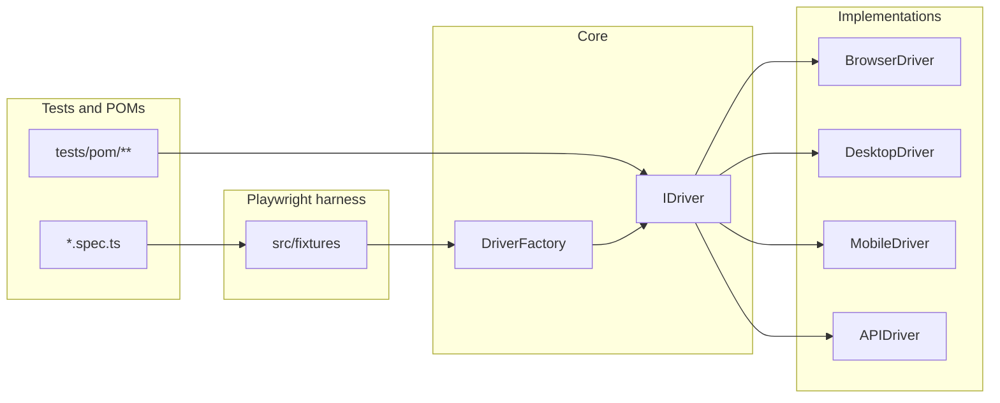
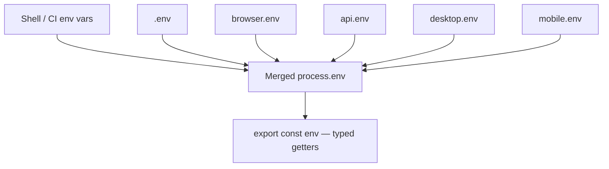
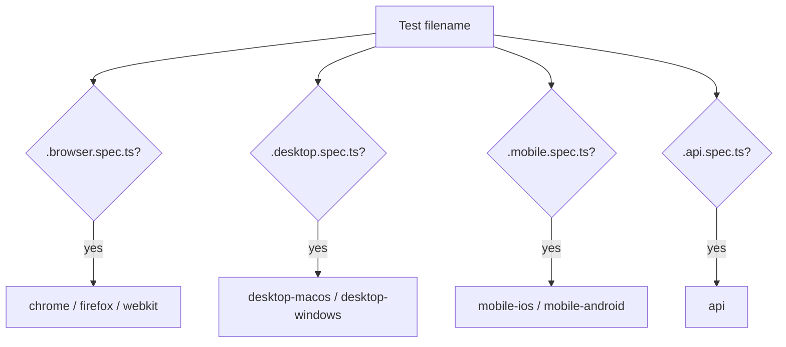

# Common foundation (all platforms)

**Part of:** [Common documentation](./README.md) · [Documentation home](../README.md)

This document covers what stays the **same on every platform**: the driver contract, factory, configuration, fixtures, environment loading, and shared POM building blocks. For platform-specific setup, open the matching guide under **Related platform docs** below.

---

## Mental model

You write tests against **`IDriver`**. The **concrete class** you get is fixed by **`Platform`** plus the project **`metadata`** in `playwright.config.ts`.

---

## `IDriver` — one contract

**File:** [`src/core/base-driver.ts`](../../src/core/base-driver.ts)

Every driver implements: `launch`, `close`, `click`, `fill`, `getText`, `waitFor`, `navigate`, `screenshot`, `getTitle`, `getURL`, …

**What a selector means depends on the platform** (browser: CSS / Playwright-style; desktop: AX / UIA name; mobile: accessibility id / XPath, and so on). The interface is the same; the semantics differ.

---

## `DriverFactory` + vision wrapper

**File:** [`src/core/driver-factory.ts`](../../src/core/driver-factory.ts)

| `platform` | Concrete driver | Vision wrapper? |
|------------|-----------------|-----------------|
| `chromium`, `firefox`, `webkit` | `BrowserDriver` | Yes, when vision is available and enabled |
| `macos`, `windows` | `DesktopDriver` | Yes, same rule |
| `ios`, `android` | `MobileDriver` | Yes, same rule |
| `api` | `APIDriver` | **No** — the factory returns `APIDriver` directly |

Vision: [`VisionDriverWrapper`](../../src/vision/vision-driver-mixin.ts) can retry failed primary actions using a screenshot and an LLM to suggest coordinates.

---

## Configuration stack

### Env files (load order)

**File:** [`src/core/env-loader.ts`](../../src/core/env-loader.ts)

Variables already set in the shell are **not overwritten** by dotenv (keeps CI defaults/secrets predictable).

### Playwright projects

**File:** [`playwright.config.ts`](../../playwright.config.ts)

Each **project** is one runner profile: `testMatch`, `metadata.platform`, URLs, desktop app defaults, mobile caps, API base URL, …

Fixture code reads `testInfo.project.metadata` (and optional title tags such as `@app=`).

---

## Test file naming → project

| Pattern | Example projects | Primary fixture driver |
|---------|------------------|------------------------|
| `*.browser.spec.ts` | `chrome`, `firefox`, `webkit` | `BrowserDriver` (often vision-wrapped) |
| `*.desktop.spec.ts` | `desktop-macos`, `desktop-windows` | `DesktopDriver` |
| `*.mobile.spec.ts` | `mobile-ios`, `mobile-android` | `MobileDriver` |
| `*.api.spec.ts` | `api` | `APIDriver` |

---

## Fixtures (`src/fixtures/index.ts`) — where each one applies

| Fixture | Browser | Desktop | Mobile | API | Notes |
|---------|:-------:|:-------:|:------:|:---:|-------|
| `app` | Yes | Yes | Yes | Yes* | *On API projects, `app` is `APIDriver`; otherwise use the `api` fixture for HTTP |
| `pom` | Yes | Yes | Yes | Limited | `PomManager` — `PageObject` branch is browser-oriented |
| `pages` | Yes | — | — | — | Separate `BrowserContext` — mostly auxiliary |
| `api` | Yes | Yes | Yes | Yes | Dedicated HTTP client |
| `auth` | Yes | Yes | Yes | Yes | Auth profile helpers |
| `checkpoint` | Yes | Yes | Yes | Yes | Per-test checkpoint manager instance |
| `resumable` | Yes** | Yes** | Yes** | No-op | **Needs an underlying `BrowserDriver` for real checkpoints |
| `network` | Yes | — | — | — | Browser HTTP capture |

More detail: [Browser POM & tests](../browser/pom-and-tests.md), [Auth & checkpoints](./auth-and-checkpoints.md).

---

## Shared POM layers

| Layer | File | Use |
|-------|------|-----|
| `ElementRef` | [`src/pom/element-ref.ts`](../../src/pom/element-ref.ts) | `click` / `fill` / `waitFor` on a selector string via `IDriver` |
| `DriverPage` | [`src/pom/driver-page.ts`](../../src/pom/driver-page.ts) | `element()`, `navigate()`, **LLM judge** (`judgeJson`, …) |
| `DesktopPage` | [`src/drivers/desktop/pom/desktop-page.ts`](../../src/drivers/desktop/pom/desktop-page.ts) | Desktop helpers on top of `DriverPage` |
| `PageObject` | [`src/drivers/browser/pom/page-object.ts`](../../src/drivers/browser/pom/page-object.ts) | Native Playwright `Page` + `locator()` — **browser** |

Browser-only multi-tab: `PageManager`, unwrap helpers — [Browser POM & tests](../browser/pom-and-tests.md).

---

## Browser launch URL fallback

**Files:** [`src/core/env-loader.ts`](../../src/core/env-loader.ts) (`resolveBrowserLaunchUrl`), [`src/drivers/browser/browser-driver.ts`](../../src/drivers/browser/browser-driver.ts)

If you call `app.launch({})`, omit `url`, or pass `url: ''`, navigation may use a non-empty **`BROWSER_BASE_URL` / `BASE_URL`** from env.

---

## Related platform docs

| Area | Guides |
|------|--------|
| **Browser** | [Browser automation](../browser/automation.md), [Browser POM & tests](../browser/pom-and-tests.md) |
| **Desktop** | [macOS](../desktop/macos.md), [Windows](../desktop/windows.md), [Desktop bridge MCP](../desktop/mcp-bridge.md) |
| **Mobile** | [iOS](../mobile/ios.md), [Android](../mobile/android.md) |
| **API** | [HTTP API testing](../api/http-testing.md) |
| **Big picture** | [Architecture overview](../architecture/overview.md) |
| **Onboarding** | [First test & setup](../configuration/first-test-and-setup.md) |
