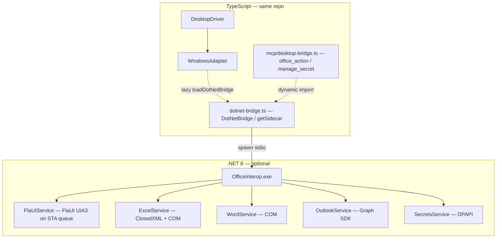

# .NET sidecar — FlaUI (UIA), Office, Graph, and DPAPI

This document describes the **optional** **.NET 8** sidecar (`OfficeInterop.exe`): **UI Automation via FlaUI** (STA thread, UIA3), plus **Microsoft-specific** work that does not belong in the main **Node / TypeScript** path — **Excel** (file + live COM), **Word** COM, **Microsoft Graph** mail, and **DPAPI** secret storage.

**It is not required** to run desktop specs. If the executable is **missing**, **`WindowsAdapter`** keeps driving **UIA through PowerShell** for `getElements` / `click` / `fill` / `getText` / `isVisible`; **vision** and the rest of the stack are unchanged. If the executable is **present** (after `npm run sidecar:build`), those same calls **prefer FlaUI** over stdio RPC and **fall back to PowerShell** if a call fails. **Office / Graph / DPAPI** RPCs still **require** the built sidecar.

**Audience:** engineers who want **FlaUI-backed UIA** in-process, or who wire **Office** workflows, **Graph** mail from tests or MCP, or **machine-local secret blobs** on Windows.

**Beginner context:** [Windows automation from zero](./windows-automation-from-zero.md) · **MCP tools:** [Desktop bridge](./mcp-bridge.md) · **Windows UI:** [windows.md](./windows.md)

---

## Table of contents

1. [Role in the architecture](#1-role-in-the-architecture)
2. [Why a separate process](#2-why-a-separate-process)
3. [Layer diagram and ownership](#3-layer-diagram-and-ownership)
4. [Process lifecycle](#4-process-lifecycle)
5. [Wire protocol (stdio JSON)](#5-wire-protocol-stdio-json)
6. [RPC methods reference](#6-rpc-methods-reference)
7. [TypeScript bridge](#7-typescript-bridge)
8. [WindowsAdapter extensions](#8-windowsadapter-extensions)
9. [MCP integration](#9-mcp-integration)
10. [Build, publish, and paths](#10-build-publish-and-paths)
11. [Microsoft Graph and `mailbox`](#11-microsoft-graph-and-mailbox)
12. [Security and DPAPI](#12-security-and-dpapi)
13. [Troubleshooting](#13-troubleshooting)
14. [Source map](#14-source-map)

---

## 1. Role in the architecture

The repository keeps **Node** lean while still allowing **STA-safe FlaUI** and **COM/DPAPI** in one optional Windows process:

| Concern                                             | Primary implementation                                                                 | Runs in         |
| --------------------------------------------------- | ---------------------------------------------------------------------------------------- | --------------- |
| UIA **tree read**, **click** / **fill** / **text** / visibility (PID-scoped) | **`WindowsAdapter`**: **FlaUI** RPC when `OfficeInterop.exe` exists, else **PowerShell UIA** | Node + optional .NET |
| Window focus, window chrome, screenshots, SendKeys  | **`WindowsAdapter`** + PowerShell / Win32 helpers                                      | Node.js process |
| Screenshot + multimodal locate/describe             | `VisionProvider`                                                                         | Node.js process |
| Excel **workbook file** read/write without Excel UI | **ClosedXML** in sidecar                                                                 | .NET process    |
| Excel **macros**, Word automation                   | **COM interop** in sidecar                                                               | .NET process    |
| Send mail / read inbox via **Graph API**            | **Microsoft.Graph** + **Azure.Identity** in sidecar                                      | .NET process    |
| Encrypt/decrypt with **user-scoped DPAPI**          | `ProtectedData` in sidecar                                                             | .NET process    |

**Reason:** **FlaUI/UIA3** and **COM** want an **STA** thread and **.NET** assemblies; Node stays **cross-platform at build time**. One **stdio** child process hosts **FlaUIService** (always loaded when the exe runs) and **Office/Graph/DPAPI** handlers **on demand**.

---

## 2. Why a separate process

1. **Isolation** — A bad COM object or hung Excel does not corrupt the Node test runner’s memory space.
2. **Optional dependency** — macOS and Linux developers never need the `.exe`; CI that only runs UIA can skip `dotnet publish`.
3. **Clear failure mode** — Missing binary → **one** predictable error from `DotNetBridge`, not obscure native addon load failures.
4. **Single channel** — **stdin/stdout** lines are easy to log, replay, and reason about compared to embedding CLR in Node.

---

## 3. Layer diagram and ownership



**Ownership rules (as implemented):**

- **`DesktopDriver`** does **not** know about the sidecar — keeps the façade stable.
- **`WindowsAdapter`** calls **`getSidecar().call('uia.*', …)`** for core UIA when the exe exists (shared **`loadDotNetBridge()`** cache), and **typed Office/secret** helpers the same way — **`dotnet-bridge`** is still loaded only via **dynamic `import()`** so macOS bundles do not pull Windows-only code at startup.
- **MCP** tools call **`getSidecar()`** directly for agent-driven workflows.

---

## 4. Process lifecycle

1. **No process** at Node startup.
2. On **first** `DotNetBridge.call()` or first **`getSidecar()`** use, the bridge checks for **`OfficeInterop.exe`**, spawns it with **hidden window**, pipes **stdin/stdout**.
3. The sidecar prints **one** JSON line `{"ready":true}` (camelCase) before accepting work. The bridge waits (bounded timeout) for that signal.
4. Each request is **one JSON object** on a **single line** (newline-delimited JSON).
5. Each response is **one JSON line** with **`ok`** / **`data`** or **`ok: false`** / **`error`**.
6. **`dispose()`** closes readline, ends stdin, kills the process — used rarely because the singleton is usually process-lifetime.

---

## 5. Wire protocol (stdio JSON)

**Request shape:**

```json
{
  "method": "excel.read_cell",
  "args": { "file": "C:\\tmp\\book.xlsx", "cell": "A1" }
}
```

**Success response:**

```json
{ "ok": true, "data": { "value": "hello" } }
```

**Error response:**

```json
{
  "ok": false,
  "method": "excel.read_cell",
  "error": "Could not find file '...'."
}
```

**Serialization:** UTF-8; property names are **camelCase** in both directions (case-insensitive deserialize on the C# side).

**Ping:**

```json
{ "method": "ping", "args": {} }
```

→ `data: { "pong": true }` — useful for smoke tests.

---

## 6. RPC methods reference

### UI Automation (FlaUI)

These methods run on a **single STA thread** inside the sidecar (`UiaStaQueue` + `UIA3Automation`). Selector semantics match the PowerShell helpers in `windows-uia-helpers.ts` (automation id first for actions, name-first for read, same pattern order for clicks).

| Method              | Purpose                                      | Args                              | Returns (inside `data`)        |
| ------------------- | -------------------------------------------- | --------------------------------- | ------------------------------ |
| `uia.get_elements`   | BFS dump of UIA nodes under the app root     | `pid` (number), optional `max`    | Array of rows (`Id`, `Name`, `Type`, `LocalizedType`, `Enabled`, `Offscreen`, `X`, `Y`, `W`, `H`, `Value`, `ClassName`) — same shape as PowerShell JSON for `getElements` mapping |
| `uia.click`        | Invoke / Toggle / ExpandCollapse / SelectionItem | `pid`, `selector` (string)        | `{ clicked: true }`            |
| `uia.fill`         | `ValuePattern.SetValue` when writable        | `pid`, `selector`, `value`        | `{ filled: true }`             |
| `uia.get_text`     | Value → Text pattern → Name                  | `pid`, `selector`                 | `{ text: string }`             |
| `uia.is_visible`   | Exact find, then loose name/id contains      | `pid`, `selector`                 | `{ visible: boolean }`         |

**Source:** `sidecar/OfficeInterop/Uia/FlaUIService.cs`, `UiaStaQueue.cs`, `UiaNative.cs`. **TypeScript** does not call these directly in tests — **`WindowsAdapter`** invokes them when `isSidecarExecutablePresent()` is true.

### Excel

| Method             | Purpose                                                  | Notable args                   | Returns (inside `data`) |
| ------------------ | -------------------------------------------------------- | ------------------------------ | ----------------------- |
| `excel.read_cell`  | Read one cell from **first worksheet**                   | `file`, `cell` (e.g. `A1`)     | `{ value: string }`     |
| `excel.write_cell` | Write one cell, save workbook                            | `file`, `cell`, `value`        | `{ written: true }`     |
| `excel.read_range` | Read rectangular range as string grid                    | `file`, `range` (e.g. `A1:C3`) | `{ rows: string[][] }`  |
| `excel.run_macro`  | Open workbook in **Excel COM**, run VBA/macro name, save | `file`, `macro`                | `{ ran: true }`         |

**Implementation note:** Read/write/range use **ClosedXML** (pure .NET, no Excel install). **`excel.run_macro`** requires **Excel installed** and may show transient COM behavior — use only when necessary.

### Word

| Method             | Purpose                                          | Args                       | Returns                      |
| ------------------ | ------------------------------------------------ | -------------------------- | ---------------------------- |
| `word.open`        | Validate file exists (does not start Word)       | `file`                     | `{ opened: true, file }`     |
| `word.insert_text` | Open doc, replace **bookmark** text, save, close | `file`, `bookmark`, `text` | `{ inserted: true }`         |
| `word.export_pdf`  | Open doc, export PDF, close                      | `file`, `output`           | `{ exported: true, output }` |

**Requires:** Word installed for `word.insert_text` / `word.export_pdf`.

### Outlook / Microsoft Graph

| Method               | Purpose                  | Args                                                                                    | Returns               |
| -------------------- | ------------------------ | --------------------------------------------------------------------------------------- | --------------------- |
| `outlook.send_email` | POST send mail via Graph | `tenantId`, `clientId`, `clientSecret`, `to`, `subject`, `body`; optional **`mailbox`** | `{ sent: true }`      |
| `outlook.list_inbox` | GET messages             | same creds + optional `top` (default 10); optional **`mailbox`**                        | `{ messages: [...] }` |

**Important:** Without **`mailbox`**, the client uses the **`/me`** send/list surface, which matches **delegated** (user) flows. For **client credentials** (app-only), supply **`mailbox`** (UPN or user id) so the sidecar calls **`/users/{mailbox}/...`**. Never commit secrets — use CI secret stores or DPAPI + env indirection.

### Secrets (DPAPI)

| Method            | Purpose                                                          | Args            | Returns                  |
| ----------------- | ---------------------------------------------------------------- | --------------- | ------------------------ |
| `secrets.encrypt` | Protect UTF-8 string, write `%APPDATA%\desktop-agent\<name>.enc` | `name`, `value` | `{ stored: true, name }` |
| `secrets.decrypt` | Read file, unprotect                                             | `name`          | `{ value: string }`      |

**Scope:** **CurrentUser** DPAPI — secrets are **not** portable across Windows users or machines.

---

## 7. TypeScript bridge

**File:** `src/drivers/desktop/dotnet-bridge.ts`

**Exports:**

- **`class DotNetBridge`** — `call(method, args)`, `dispose()`, `[Symbol.asyncDispose]`
- **`getSidecar()`** — process-wide singleton (stateless RPC; one channel is enough)
- **`isSidecarExecutablePresent()`** — synchronous check that **`OfficeInterop.exe`** exists on disk (publish or bin path). Does **not** start the process; used by **`WindowsAdapter`** to choose FlaUI vs PowerShell without spawning.

**Executable resolution:** After `dotnet publish`, the bridge prefers:

`sidecar/OfficeInterop/bin/Release/net8.0-windows/publish/OfficeInterop.exe`

and falls back to the non-publish build output path if present.

**Fixture note:** Playwright’s **`app`** fixture is typed as **`IDriver`** / **`DesktopDriver`**. It does **not** automatically expose **`excelReadCell`** — either:

- Call **`getSidecar().call(...)`** from tests or helpers, or
- Use a harness that holds **`WindowsAdapter`** directly, or
- Use MCP **`office_action`** from Cursor.

Typed convenience methods live on **`WindowsAdapter`** (see below).

---

## 8. WindowsAdapter extensions

**File:** `src/drivers/desktop/windows-adapter.ts`

**FlaUI (built-in path):** For **`getElements`**, **`click`**, **`fill`**, **`getText`**, and **`isVisible`**, the adapter uses a **cached** **`loadDotNetBridge()`** promise. If **`isSidecarExecutablePresent()`** is true, it **`getSidecar().call('uia.*', …)`** first; on **`null`** or RPC failure it **falls back to PowerShell UIA** (same public behavior, different engine).

**Office / secrets (typed helpers at end of class):** **`excelReadCell`**, **`wordExportPdf`**, **`secretsSave`**, **`outlookListInbox`**, … — each uses the same **`loadDotNetBridge()`** then **`getSidecar().call(...)`** so the bridge loads when you first touch sidecar APIs (FlaUI or Office).

---

## 9. MCP integration

**Tools (stdio MCP server):**

| Tool                | When to use                                                                    |
| ------------------- | ------------------------------------------------------------------------------ |
| **`office_action`** | Agent supplies `action` enum + `args` record for any row in §6                 |
| **`manage_secret`** | High-level **save** / **load** mapped to `secrets.encrypt` / `secrets.decrypt` |

**Platform guard:** On non-Windows, both tools return a short **Windows-only** message with **`isError: true`** — no native crash.

Details and parameter schemas: [mcp-bridge.md](./mcp-bridge.md).

---

## 10. Build, publish, and paths

**Prerequisites:** Windows machine (or cross-publish setup your org supports), **.NET 8 SDK**.

**Scripts (from repo root `package.json`):**

| Script                      | Command purpose                                                              |
| --------------------------- | ---------------------------------------------------------------------------- |
| **`npm run sidecar:build`** | `dotnet publish` Release, not self-contained (`-p:SelfContained=false`)      |
| **`npm run sidecar:clean`** | `dotnet clean` the project                                                   |
| **`npm run sidecar:ping`**  | `dotnet run` — should print **`{"ready":true}`** then exit when stdin closes |

**Git:** `sidecar/*/bin/` and `sidecar/*/obj/` are ignored — binaries are **local build artifacts**.

---

## 11. Microsoft Graph and `mailbox`

Graph **application permissions** with a client secret typically **do not** have a **`Me`** identity. Pass:

```json
"mailbox": "automation-bot@contoso.com"
```

in **`office_action`** `args` (or extend your own harness) so the sidecar targets **`Users[mailbox]`** instead of **`Me`** for **send** and **list inbox**.

---

## 12. Security and DPAPI

- **DPAPI blobs** are **opaque** on disk (`*.enc`) — they are **not** plaintext secrets.
- **Sidecar stderr** should not be used to print secret values (current services avoid that).
- **Graph credentials** belong in **secret managers** / pipeline variables — never in repo or POM source.
- **`manage_secret` load** returns the **plaintext** to the MCP client — treat MCP session logs as sensitive when using that tool.

---

## 13. Troubleshooting

| Problem                        | Likely cause                                        | Fix                                              |
| ------------------------------ | --------------------------------------------------- | ------------------------------------------------ |
| `sidecar not found`            | No publish/build on this machine                    | Run **`npm run sidecar:build`** on Windows       |
| `Sidecar did not signal ready` | Exe crashed on start (missing VC runtime, bad tfm)  | Run **`sidecar:ping`** in a console; read stderr |
| FlaUI / `uia.*` always falls back to PowerShell | Stale exe before `uia.*` existed, or runtime UIA error | Rebuild sidecar; inspect **`[sidecar stderr]`** in the test process |
| COM errors on macro / Word     | Office not installed / repair                       | Install Office; retry                            |
| Graph 401/403                  | Wrong tenant/app registration or missing permission | Azure Portal: API permissions, admin consent     |
| `Me` not allowed               | App-only context                                    | Add **`mailbox`** (see §11)                      |
| Decrypt fails                  | Different Windows user                              | DPAPI is per-user; re-save under the test user   |

---

## 14. Source map

| Path                                         | Role                                           |
| -------------------------------------------- | ---------------------------------------------- |
| `sidecar/OfficeInterop/OfficeInterop.csproj` | SDK project, packages (`FlaUI.*`, Office, Graph), `net8.0-windows` |
| `sidecar/OfficeInterop/Program.cs`           | stdin loop, dispatch, ready line             |
| `sidecar/OfficeInterop/RpcRequest.cs`        | DTO for inbound line                         |
| `sidecar/OfficeInterop/Uia/UiaStaQueue.cs`   | STA thread + `UIA3Automation` queue            |
| `sidecar/OfficeInterop/Uia/UiaNative.cs`     | Per-monitor DPI awareness for UI work          |
| `sidecar/OfficeInterop/Uia/FlaUIService.cs` | `uia.*` RPC handlers (find, patterns, collect) |
| `sidecar/OfficeInterop/ExcelService.cs`      | ClosedXML + Excel COM macro                    |
| `sidecar/OfficeInterop/WordService.cs`       | Word COM                                       |
| `sidecar/OfficeInterop/OutlookService.cs`    | Graph + optional mailbox routing               |
| `sidecar/OfficeInterop/SecretsService.cs`    | DPAPI file helpers                             |
| `src/drivers/desktop/dotnet-bridge.ts`       | Spawn, queue, JSON lines, exe presence helper  |
| `src/drivers/desktop/windows-adapter.ts`     | FlaUI-first UIA + PS fallback; Office wrappers |
| `mcp/desktop-bridge.ts`                      | **`office_action`**, **`manage_secret`** tools |

---

[← Desktop hub](./README.md) · [Documentation home](../README.md)
