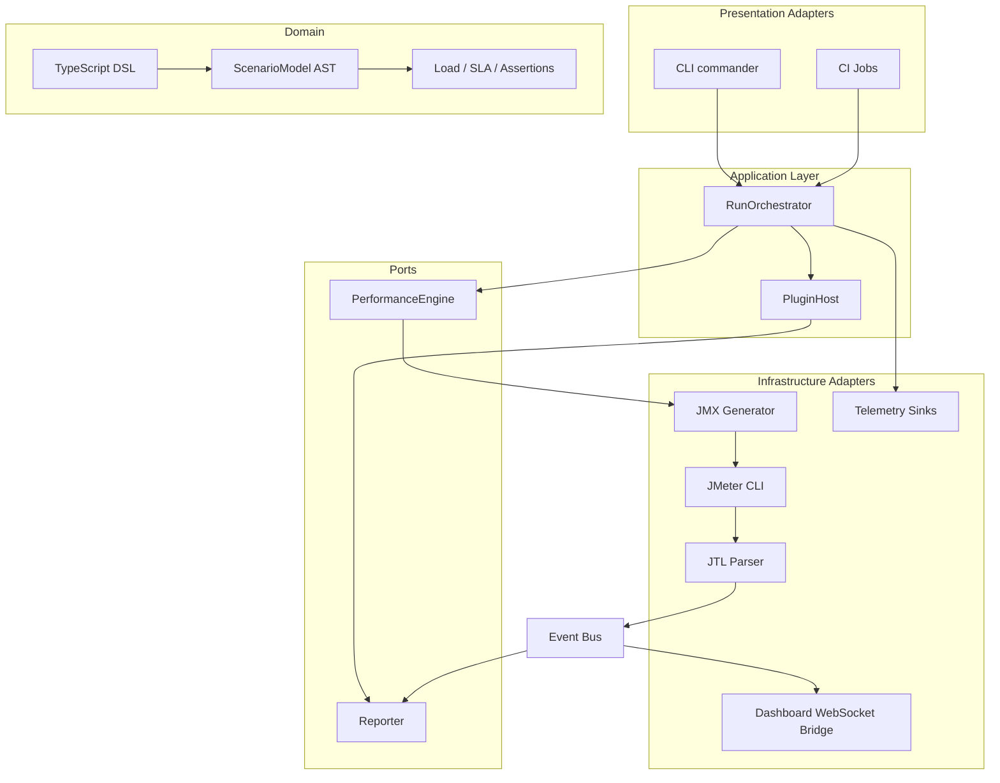
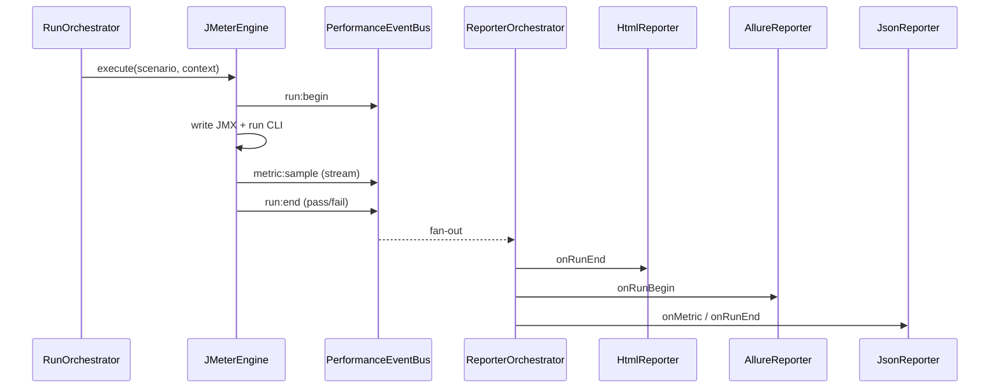
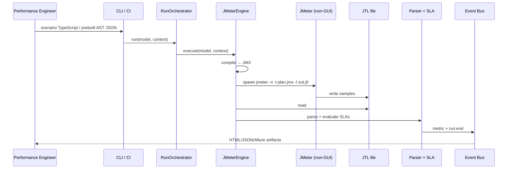

# Enterprise Performance Framework — Architecture

This document describes an **independently owned** performance testing platform that uses **Apache JMeter only as a low-level execution runtime**. The functional Playwright stack is **not** a dependency; optional integration happens through **shared contracts** (for example `contracts/auth-provider.ts`).

## 1. Isolation & ownership boundaries

| Concern | Functional QA (owns) | Performance Engineering (owns) |
|--------|----------------------|---------------------------------|
| Browser automation | Playwright drivers, POM, fixtures | — |
| Performance DSL & scenarios | — | TypeScript DSL, AST, workload semantics |
| Test orchestration | Playwright runner / CI jobs | `RunOrchestrator`, distributed jobs, gates |
| Execution runtime | — | **Adapter-selected** (default: JMeter non-GUI) |
| Reporting | Playwright / Allure for functional | Event bus, reporter plugins, HTML/JSON/Allure sinks |
| Observability wiring | Functional traces (optional) | OTel metrics, InfluxDB, Grafana, Kafka sinks |

**Release lifecycle:** version and publish `performance-framework/` as its own package or container images. Do not couple semver of this package to the Playwright framework.

**Shared contracts only:** publish small interface-only modules (for example `AuthProvider`) in a neutral package consumed by both worlds — never import Playwright internals from the performance tree.

## 2. Repository layout & module dependency graph

```
performance-framework/
├── contracts/                 # OPTIONAL cross-team interfaces (no Playwright)
├── src/
│   ├── dsl/                   # Fluent TypeScript scenario API (public to perf engineers)
│   ├── ast/                   # ScenarioModel — compiler input, engine-agnostic
│   ├── domain/                # Value objects: load profiles, assertions, SLA
│   ├── engine/                # PerformanceEngine port (hexagon inbound)
│   ├── adapters/jmeter/       # JMX generation, CLI, JTL parsing (outbound adapter)
│   ├── events/                # Typed event bus (domain events)
│   ├── reporting/             # Reporter port + built-in implementations
│   ├── plugins/               # Reporter/engine extensions
│   ├── orchestration/         # Application services bridging engine + policies
│   ├── realtime/              # WebSocket bridge for live dashboards
│   ├── observability/         # Telemetry abstraction
│   └── cli/                   # commander entrypoints
├── docker/                    # Controller + JMeter worker images
├── k8s/                       # Controller, workers, HPA, ingress samples
├── ci/                        # GitHub Actions / Jenkins / GitLab templates
└── dashboard/                 # Optional React live UI (decoupled package)
```

**Dependency rule (clean/hexagonal):**

- `dsl` → `ast`, `domain`
- `orchestration` → `engine`, `events`, `plugins`
- `adapters/jmeter` → `engine`, `ast`, `domain`, `events` (never imported by `dsl`)
- `reporting` → `events` only (subscribe; no knowledge of JMeter)



## 3. DSL → AST → engine (design)

- **DSL** (`scenario`, `get/post/...`, `transaction`) produces a **pure data** `ScenarioModel`.
- **AST** is serializable JSON (for inspection, CI caching, remote workers).
- **PerformanceEngine** compiles + executes:
  - `JMeterEngine.compile` writes `.jmx` via `xmlbuilder2` (only this adapter emits JMeter XML).
  - `JMeterEngine.execute` runs `jmeter -n`, parses `.jtl`, emits metrics on the bus.

Future engines implement the same port:

- `K6Engine`, `GatlingEngine`, `LocustDriverAdapter`, etc.

## 4. Adapter pattern & engine replacement

```ts
// Port (framework core)
export interface PerformanceEngine {
  readonly id: string;
  compile(model: ScenarioModel, context: RunContext): Promise<void>;
  execute(model: ScenarioModel, context: RunContext): Promise<ExecutionSummary>;
}
```

**Principle:** nothing in `dsl/`, `ast/`, `domain/`, or `orchestration/` imports `adapters/jmeter/*`. Wire the implementation in composition roots (`cli`, CI bootstrap, DI container).

## 5. Load profile & scenario taxonomy

The `LoadProfile.kind` enumerates scenario classes requested by the enterprise:

| Business term | Representation |
|----------------|----------------|
| Load | `constant` / `ramp_up` + steady `duration` |
| Stress | `stress` + high `users` / long `duration` |
| Spike | `spike` + `spikePeakUsers` / `spikeInterval` |
| Soak | `soak` + long `duration` or `infiniteSoak` |
| Volume | `volume` + large payload / data-driven CSV |
| Breakpoint | `breakpoint` — increase until SLAs fail (policy in orchestrator) |

Adapters map these logical kinds to **runtime-specific** schedulers (JMeter Thread Group, timers, stepping thread group plugins, arriving threads, etc.) without surfacing JMeter nouns in the DSL.

## 6. Event-driven reporting



**Reporter interface** (playwright-style lifecycle hooks; extensible):

```ts
export interface Reporter {
  onRunBegin?(payload: { runId: string; scenarioName: string }): Promise<void>;
  onScenarioBegin?(payload: { runId: string; scenarioId: string }): Promise<void>;
  onMetric?(payload: { label: string; elapsedMs: number; success: boolean; responseCode: string }): Promise<void>;
  onScenarioEnd?(payload: { runId: string; scenarioId: string }): Promise<void>;
  onRunEnd?(payload: { runId: string; passed: boolean; violations: string[] }): Promise<void>;
}
```

## 7. Metrics parsing & SLA validation

1. **JTL** (CSV default) → `parseJtlCsv` → normalized `JtlSample[]`.
2. **Assertion engine** merges:
   - SLA rules from `scenario.slaRule(...)`
   - Request-level assertions from `assertStatus`, `assertP95Below`, etc.
3. `evaluateAssertions` computes percentiles / error rate / status compliance.
4. Violations become CI **performance gates** (GitHub/Jenkins/GitLab templates under `ci/`).

Trend analysis & regression comparison: store `report.json` artifacts per build; a future `TrendReporter` plugin diff-keys on git SHA + scenario hash.

## 8. Realtime dashboard architecture

- **Backend:** `attachDashboardBridge` fans out selected bus events over **WebSocket** (`ws`).
- **Frontend:** separate `dashboard/` Vite+React package subscribing to events:
  - Live TPS, active threads (from `metric:sample` aggregation windows)
  - Percentile charts (**Chart.js**)
  - Error rate / throughput
- **Production:** put gateway + auth in front; do not expose raw worker ports.

## 9. Distributed execution

**Local:** single `JMeterEngine` process.

**Docker Compose:** controller image + scalable `jmeter-worker` image; extend adapter to pass `-R worker1,worker2` when ready.

**Kubernetes:**

- `perf-controller` Deployment (job-or CronJob in real clusters)
- `jmeter-worker` Deployment + **HPA** on CPU/custom metrics
- **NetworkPolicy** restricting RMI / control ports
- **PodDisruptionBudgets** for long soak tests

Coordinate shards via orchestrator extensions:

- Split scenarios by scenario ID / tenant / region; aggregate metrics in Kafka or InfluxDB.

## 10. Observability

- **OpenTelemetry:** implement `TelemetrySink` with your org’s OTel SDK (`observability/telemetry.ts` ships a noop).
- **InfluxDB:** reporter plugin writes line protocol from `metric:aggregate` events.
- **Grafana:** dashboards fed from InfluxDB / Prometheus remote-write.
- **Kafka:** stream `metric:sample` for centralized analytics (extra subscriber).

## 11. Plugin architecture

`PluginHost` registers:

- **Custom reporters** (S3 upload, Slack gate notifier, DataDog).
- **Engine wrappers** (retry policies, canary rollout of engine version).
- Future: **custom load shaping** by transforming `LoadProfile` before compile.

## 12. CI/CD integration (isolated jobs)

Templates live in `ci/`:

- **GitHub Actions:** install JMeter tarball, `npm ci`, `npm run build`, `run:smoke`, upload artifacts, optional gate.
- **Jenkins:** Kubernetes agent pod with Node + JMeter sidecar pattern.
- **GitLab CI:** `perf:smoke` job in a dedicated stage.

Keep **functional** workflows in separate YAML files to preserve ownership clarity.

## 13. Security & production hardening

- Run JMeter with **least-privilege** service accounts; never mount cluster-admin kubeconfigs into controller pods.
- Treat scenario files & dynamic CSVs as **untrusted input**; sanitize paths; reject `..` segments when loading data sources.
- **Secrets:** Kubernetes `Secret` references for tokens; integrate `AuthProvider` implementations that call your identity service — no static tokens in git.
- **Resource limits:** CPU/memory requests+limits on workers; Java `HEAP` tuned per pod.
- **Isolate noisy neighbor tests** by namespace per team + quota.

## 14. Scalability recommendations

- Pre-compile **ScenarioModel → engine artifact** in CI; ship artifact to workers (avoid recompilation on each pod).
- Use **coordinated omission-aware** percentile calculations for streaming metrics.
- For very large JTL files, switch to **streaming CSV parsers** + disk spill.
- Externalize **correlation rules** to a DSL extension with tests — avoid ad-hoc Groovy in JMX leaking upward.

## 15. Sequence — end-to-end run



---

### Operational quickstart (local)

**Full step-by-step workflow** (writing scenarios, runners, CI, outputs): [WORKFLOW.md](./WORKFLOW.md).

```bash
cd performance-framework
npm ci
npm run build
# Requires JMeter on PATH or JMETER_HOME:
node dist/cli/perf.js run:smoke
```

This repository snapshot ships a **minimal vertical slice**; expand adapters (distributed `-R`, Influx reporter, full GraphQL/WebSocket coverage) inside `adapters/` and `plugins/` only.
