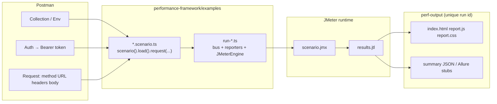
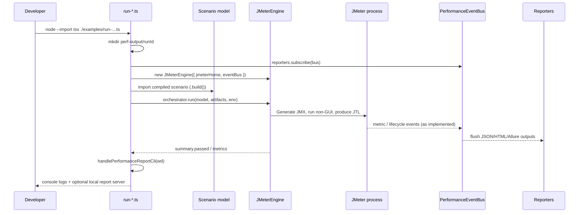

# From Postman (OAuth 2.0 + POST API) to a load test — detailed walkthrough

This guide assumes you already have:

- A **REST API** you want to **load test** or **stress test**
- Optionally, a **Postman collection** where:
  1. **Auth** uses **OAuth 2.0** (you eventually get an **access token**)
  2. A **POST** request with specific **headers** and **body** that returns a normal response

The framework turns a **TypeScript scenario** into a **JMeter** run and produces **JSON + HTML** reports. There is **no automatic “Import Postman collection”** yet — you **translate** Postman into DSL calls (usually one-time, then you iterate on load).

---

## Table of contents

1. [Prerequisites](#1-prerequisites)
2. [Folders and artifacts](#2-where-to-put-your-files-folders)
3. [Big picture workflows (diagrams)](#3-big-picture-workflows-diagrams)
4. [Mental model: Postman ↔ framework](#4-mental-model-postman-vs-this-framework)
5. [Worked example — live API (JSONPlaceholder)](#5-worked-example--live-api-jsonplaceholder-step-by-step)
6. [Runner file — line by line](#6-runner-file--line-by-line)
7. [Multiple steps, transactions, and OAuth APIs](#7-multiple-steps-transactions-and-oauth-apis)
8. [Load shaping (stress, spike, soak)](#8-spike-like-vs-stress-like-load-todays-jmeter-mapping)
9. [Scripts, commands, CI](#9-scripts-commands-environment-and-ci)
10. [Checklist](#10-quick-checklist-postman--dsl)
11. [Hinglish quick reference](#11-hinglish-quick-reference-short)
12. [Related docs](#related-docs)

---

## 1. Prerequisites

| Requirement | Why |
|-------------|-----|
| **Node.js 20+** | Runs the TypeScript runner and DSL (`performance-framework/package.json` sets `engines.node`) |
| **JMeter** installed / discoverable (`JMETER_HOME`, `PATH`, or package manager) | Executes the generated test plan (`JMeterEngine`) |
| This repo’s **`performance-framework`** package | Contains the DSL, engine adapters, reporters, and examples |

See the package **README** and **QUICKSTART** for one-time JMeter setup.

---

## 2. Where to put your files (folders)

All paths below are inside **`performance-framework/`** (the package root).

| Path | Purpose |
|------|---------|
| **`examples/`** | Best place for **your** scenario + runner while learning (patterns match `jsonplaceholder-load.scenario.ts` and `run-jsonplaceholder-load.ts`) |
| **`src/`** | Framework implementation — you normally **do not** put business API tests here |
| **`perf-output/`** | **Generated** per run (JTL, HTML report bundles, etc.) — do not commit |

**Recommended layout under `examples/`:**

| File | Role |
|------|------|
| `examples/<name>.scenario.ts` | Describes **what** to call (URLs, bodies, assertions) and **how much load** (`load`, `slaRule`, tags) |
| `examples/run-<name>.ts` | **Glue**: event bus → reporters → `JMeterEngine` → `RunOrchestrator.run(...)` → `handlePerformanceReportCli` |

The repository already ships a **full runnable pair** you can copy:

- `examples/jsonplaceholder-load.scenario.ts` — real HTTPS API (**JSONPlaceholder**) with **GET + POST** in one **transaction**
- `examples/run-jsonplaceholder-load.ts` — production-style runner wired to **`perf-output/<runId>/`**

> **Hinglish:** Tum apna load test **`examples/`** ke andar rakho — ek file scenario (`*.scenario.ts`), ek runner (`run-*.ts`). **`src/`** sirf framework hai. **`perf-output/`** har run ke baad banta hai, git ignore karo.

---

## 3. Big picture workflows (diagrams)

### 3.1 From Postman mindset to artifacts on disk

This is the **human workflow**: you mentally map tabs in Postman to DSL methods; the runner owns everything after that.



### 3.2 What happens inside the runner (conceptual sequence)

Each numbered step matches the **order** you typically see when reading `run-jsonplaceholder-load.ts`.



---

## 4. Mental model: Postman vs this framework

| Postman | This framework |
|---------|----------------|
| Collection + folders + requests | **`scenario('...')`** + **`.request(...)`**, **`.transaction(...)`**, or **`.parallel(...)`** |
| OAuth 2.0 token helper | You typically provide a **Bearer token string** at runtime — **`process.env.MY_TOKEN`** + **`.bearerToken(...)`**, or equivalent |
| Headers / Body tabs | **`.header(...)`**, **`.body({ ... })`**, **`.rawBody('...')`**, **`.graphql(...)`** |
| “Send” once | JMeter executes **many virtual users** according to **`users`**, **`rampUp`**, **`duration`** |
| Test scripts on response | Prefer **`.assertStatus`**, **`.assertP95Below`** / **`assertP99Below`**, SLA rules |

OAuth 2.0 in Postman often uses a **browser** or **refresh-token** UX. Under load:

1. **Preferred:** obtain token **outside** JMeter (Postman, small script, CI secret vault) → `export MY_API_TOKEN=...`
2. **Sometimes:** **`client_credentials`** POST to `/token` → **today** simplest path is often still **pre-fetch env token** unless the token endpoint is trivial and stable under concurrency

DSL reminder for auth:

```typescript
requestBuilder.bearerToken(process.env.MY_API_TOKEN ?? '');
// equivalent mentally to Postman Authorization type OAuth 2.0 → Bearer Token
```

> **Hinglish:** Postman token UI se token laata hai; yahan **`env`** se string chahiye. **`.bearerToken`** = `Authorization: Bearer ...`.

---

## 5. Worked example — live API (JSONPlaceholder), step by step

We use a **real** public HTTPS API documented at [JSONPlaceholder Guide](https://jsonplaceholder.typicode.com/guide/).

- **GET** `https://jsonplaceholder.typicode.com/posts/1` → **200** (read path)
- **POST** `https://jsonplaceholder.typicode.com/posts` → **201** with JSON `{ title, body, userId }` (simulate create)

Both calls hit the network every iteration — same class of “does my scenario compile to real HTTP?” confidence you get after **Send** in Postman.

This mirrors the shipped file **`examples/jsonplaceholder-load.scenario.ts`** (names and numbers tweaked here only if needed for clarity; treat the repo file as canonical).

### Step 0 — Reproduce once in Postman (sanity check)

Before load, confirm **latency** and **status codes**:

1. Create request **GET** URL `https://jsonplaceholder.typicode.com/posts/1` → expect **200**
2. Create request **POST** URL `https://jsonplaceholder.typicode.com/posts`
   - Header: `Content-Type: application/json; charset=UTF-8` (matches common Postman presets)
   - Body (raw JSON):

```json
{
  "title": "perf-fw example",
  "body": "load test",
  "userId": 1
}
```

3. **Send** → expect **201** and JSON body containing an `id` field (fake but stable contract)

Once this works in Postman, every field above has a clear DSL counterpart.

### Step 1 — Create the scenario shell

**File:** `examples/jsonplaceholder-demo.scenario.ts` (conceptual name — repo uses `jsonplaceholder-load.scenario.ts`)

**Imports.**

```typescript
import { scenario, get, post } from '../src/index.js';
```

- **`scenario`** — names the scenario (shows in HTML / JSON summaries)
- **`get` / `post`** — HTTP builders (also: **`put`**, **`patch`**, **`del`**)

Open the envelope:

```typescript
export const jsonPlaceholderLoadModel = scenario('JSONPlaceholder — posts API load');
```

Equivalent Postman notion: creating a **new collection item** titled “JSONPlaceholder — posts API load”.

### Step 2 — Tags and metadata (optional but useful)

Tags help filtering in dashboards or future tooling.

```typescript
  .tag('example', 'public-api', 'rest')
```

### Step 3 — Define load shape

Pick **parallel users**, **how fast they ramp**, and **total schedule duration**:

```typescript
  .load({
    kind: 'ramp_up',
    users: 8,
    rampUp: '8s',
    duration: '35s',
  })
```

Interpretation vs Postman:

- Postman sends **one** request per click.
- Here **`users`** is “how many concurrent threads logically attack the backend.”
- **`rampUp`** spreads thread start across **8 seconds** (smoother than all-at-once).
- **`duration`** keeps the scheduler running about **35s** overall.

Allowed **`kind`** values include **`constant`**, **`ramp_up`**, **`spike`**, **`stress`**, **`soak`**, and more (`src/domain/load-profile.ts`). Practically (see §8), the current JMeter mapping still boils down heavily to **`users` + ramp + duration** — set expectations accordingly.

### Step 4 — Define an SLA gate (global)

```typescript
  .slaRule({
    name: 'jsonplaceholder-sla',
    p95Ms: 3000,
    maxErrorRatePercent: 5,
  })
```

Rough Postman analogue: collection-level monitors / performance goals — enforced when the orchestrator summarizes the run against model thresholds.

### Step 5 — Group related requests as one **transaction**

A **transaction** is a labeled block of sequential steps executed **together** each iteration:

```typescript
  .transaction('Read and create post', (tx) => {
```

Postman analogue: folder “Read and create post” where requests run **in order** inside the same iteration.

Inside the callback `tx`:

**5a — First HTTP call (GET)**

```typescript
    tx.request(
      get('https://jsonplaceholder.typicode.com/posts/1', 'get-post-by-id')
        .assertStatus(200)
        .assertP95Below(3000),
    );
```

Map from Postman row by row:

| Postman concept | DSL piece |
|-----------------|-----------|
| Method GET | `get(...)` |
| URL bar | First argument `'https://.../posts/1'` |
| Request name column | Second argument **`'get-post-by-id'`** (appears in JMeter / HTML tables) |
| Test → status equals 200 | `.assertStatus(200)` |
| “p95 SLA per request” (performance mindset) | `.assertP95Below(3000)` |

**5b — Second HTTP call (POST)**

```typescript
    tx.request(
      post('https://jsonplaceholder.typicode.com/posts', 'create-post')
        .header('Content-Type', 'application/json; charset=UTF-8')
        .body({ title: 'perf-fw example', body: 'load test', userId: 1 })
        .assertStatus(201)
        .assertP95Below(3000),
    );
  })
```

| Postman | DSL |
|---------|-----|
| POST + URL | `post('https://.../posts', 'create-post')` |
| Headers tab | `.header('Content-Type', ...)` |
| Body → raw JSON | `.body({ ... })` |
| Tests → status 201 | `.assertStatus(201)` |

### Step 6 — Materialize the immutable model

```typescript
  .build();
```

**Full shape** (matches repository example structure):

```typescript
import { scenario, get, post } from '../src/index.js';

export const jsonPlaceholderLoadModel = scenario('JSONPlaceholder — posts API load')
  .tag('example', 'public-api', 'rest')
  .load({
    kind: 'ramp_up',
    users: 8,
    rampUp: '8s',
    duration: '35s',
  })
  .slaRule({
    name: 'jsonplaceholder-sla',
    p95Ms: 3000,
    maxErrorRatePercent: 5,
  })
  .transaction('Read and create post', (tx) => {
    tx.request(
      get('https://jsonplaceholder.typicode.com/posts/1', 'get-post-by-id')
        .assertStatus(200)
        .assertP95Below(3000),
    );
    tx.request(
      post('https://jsonplaceholder.typicode.com/posts', 'create-post')
        .header('Content-Type', 'application/json; charset=UTF-8')
        .body({ title: 'perf-fw example', body: 'load test', userId: 1 })
        .assertStatus(201)
        .assertP95Below(3000),
    );
  })
  .build();
```

**Progressive learning path** (if you want to build confidence before using `transaction`):

1. **Only POST** — single `.request(post(...))` + `.load(...)` + `.build()`
2. **GET then POST** as two top-level `.request(...)` calls (same order per iteration)
3. **Wrap** both in `.transaction('Read and create post', ...)` for clearer reporting boundaries

### Step 7 — Other request features you may need (reference)

From `src/dsl/request-builders.ts`:

| Need | Method |
|------|--------|
| Arbitrary header | `.header(key, value)` |
| Cookies | `.cookie(name, value)` |
| Bearer OAuth token | `.bearerToken(tokenString)` |
| JSON body | `.body(obj)` |
| Non-JSON / form string | `.rawBody('grant_type=client_credentials&...')` |
| GraphQL | `.graphql(query, variables?)` |
| Think time between substeps | `.think({ type: 'uniform', minMs: 100, maxMs: 400 })` |
| Capture JSON for later steps | `.captureJson('name', '$.access_token')` (advanced pipelines) |
| Assertions | `.assertStatus`, `.assertP95Below`, `.assertP99Below` |

---

## 6. Runner file — line by line

**Canonical file:** `examples/run-jsonplaceholder-load.ts`

### 6.1 Imports and run identity

```typescript
import { mkdir } from 'node:fs/promises';
import { join, resolve } from 'node:path';
import { randomUUID } from 'node:crypto';
```

- **`randomUUID()`** — unique directory per run under `perf-output/`
- **`mkdir`** — ensures artifacts land in a fresh folder

### 6.2 Framework imports

```typescript
import {
  PerformanceEventBus,
  ReporterOrchestrator,
  JsonReporter,
  HtmlReporter,
  AllureReporter,
  JMeterEngine,
  RunOrchestrator,
  handlePerformanceReportCli,
} from '../src/index.js';
import { jsonPlaceholderLoadModel } from './jsonplaceholder-load.scenario.js';
```

| Symbol | Responsibility |
|--------|----------------|
| **`PerformanceEventBus`** | Internal pub/sub for run lifecycle + metrics |
| **`ReporterOrchestrator`** | Fan-out to multiple reporters |
| **`JsonReporter` / `HtmlReporter` / `AllureReporter`** | Emit machine + human artifacts |
| **`JMeterEngine`** | DSL model → JMX + **JMeter non-GUI** execution + JTL ingestion |
| **`RunOrchestrator`** | Single `run(model, context)` entrypoint |
| **`handlePerformanceReportCli`** | Local HTML UX (default interactive server on **50552** unless CI / env disables it) |

### 6.3 Working directory setup

```typescript
const runId = randomUUID();
const wd = resolve(process.cwd(), 'perf-output', runId);
await mkdir(wd, { recursive: true });
```

Every run is isolated — safe for comparisons in CI or notebooks.

### 6.4 Reporters wired to bus

```typescript
const bus = new PerformanceEventBus();
const reporters = new ReporterOrchestrator([
  new JsonReporter(wd),
  new HtmlReporter(wd),
  new AllureReporter(join(wd, 'allure-results')),
]);
reporters.subscribe(bus);
```

### 6.5 Engine + orchestrator execution

```typescript
const engine = new JMeterEngine({
  jmeterHome: process.env.JMETER_HOME,
  eventBus: bus,
});
const orchestrator = new RunOrchestrator(engine);

const summary = await orchestrator.run(jsonPlaceholderLoadModel, {
  runId,
  environment: process.env.PERF_ENV ?? 'local',
  artifacts: {
    workingDirectory: wd,
    primaryArtifactPath: join(wd, 'scenario.jmx'),
    resultsPath: join(wd, 'results.jtl'),
  },
  env: process.env,
});
```

**Key ideas:**

- **`JMETER_HOME`** — tell the runner where binaries live when not globally on PATH
- **`scenario.jmx` / `results.jtl`** — classic JMeter artifacts — still produced for forensic debugging
- **`summary.passed`** — drives CI exit semantics after HTML handling

### 6.6 Human UX + CI exit codes

```typescript
console.log('Run directory:', wd);
console.log('Summary:', JSON.stringify(summary, null, 2));

await handlePerformanceReportCli(wd, summary.passed);
if (!summary.passed) {
  process.exit(1);
}
```

> **Hinglish:** Runner = **glue**. Scenario sirf batati hai **kya** load karna hai; runner **events + JMeter + report** pakadta hai.

---

## 7. Multiple steps, transactions, and OAuth APIs

Postman commonly shows **OAuth token** fetch then **business POST**. Patterns:

### 7.1 Two sequential `.request()` calls at scenario level

Each iteration executes **step 1** then **step 2** — same threading story as sequential requests inside Postman Runner.

### 7.2 One `.transaction(...)` grouping

Better for readability + reporting when steps belong to **one logical user journey** (shown in §5).

### 7.3 OAuth-heavy API (pseudo outline)

Translate Postman OAuth token request:

```typescript
scenario('OAuth then POST')
  .load({ users: 5, rampUp: '5s', duration: '60s' })
  .request(
    post('https://auth.example.com/oauth/token', 'token')
      .header('Content-Type', 'application/x-www-form-urlencoded')
      .rawBody('grant_type=client_credentials&client_id=...&client_secret=...')
      // If you must chain dynamically, explore .captureJson + variables in advanced setups;
      // most teams still export ACCESS_TOKEN from outside for stability.
  )
  .request(
    post('https://api.example.com/v1/action', 'main-post')
      .bearerToken(process.env.MY_API_TOKEN ?? '')
      .header('Content-Type', 'application/json')
      .body({ /* fields from Postman body */ })
      .assertStatus(200),
  )
  .build();
```

> **Hinglish:** Complex OAuth = pehle **token bahar** nikaalo, phir load test **sirf business POST** pe — zyada reliable.

### 7.4 Parallel fan-out (when applicable)

```typescript
scenario('Parallel health checks')
  .load({ users: 4, rampUp: '4s', duration: '20s' })
  .parallel(
    get('https://api.example.com/health/live', 'liveness'),
    get('https://api.example.com/health/ready', 'readiness'),
  )
  .build();
```

---

## 8. Spike-like vs stress-like load (today’s JMeter mapping)

The DSL **`LoadProfile`** models many **kinds** (`spike`, `stress`, `soak`, …), but the **current JMeter generator** still centers on **one Thread Group** driven mainly by:

- **`users`**
- **`rampUp`**
- **`duration`**

Practical recipes:

| Goal | How to approximate (today) |
|------|----------------------------|
| **Spike** (sudden burst) | **Higher `users`**, **shorter `rampUp`**, **shorter `duration`** |
| **Stress** (find ceiling) | **Raise `users` across multiple runs** or **long `duration` + high `users`**, watch error rate + p95 in HTML |
| **Soak** (stability) | **Moderate `users`**, **long `duration`** |

Spike-like:

```typescript
.load({
  users: 50,
  rampUp: '5s',
  duration: '45s',
})
```

Gentle ramp / exploration:

```typescript
.load({
  users: 20,
  rampUp: '60s',
  duration: '10m',
})
```

> **Hinglish:** Abhi zyada tar **`users` + rampUp + duration** se hi feel aayegi — `kind` future mapping ke liye semantic label jaisa treat karo.

---

## 9. Scripts, commands, environment, and CI

### 9.1 `package.json` scripts (already present)

```json
"example:jsonplaceholder": "node --import tsx ./examples/run-jsonplaceholder-load.ts"
```

Add your own:

```json
"example:my-api": "node --import tsx ./examples/run-my-api.ts"
```

### 9.2 Build the browser report bundle

From **`performance-framework/`**:

```bash
npm run build:report-client
```

The **`prepare`** hook also runs **`build:report-client`** after install — first-time contributors usually already have `report.js` generated.

### 9.3 Run the JSONPlaceholder example end-to-end

```bash
cd performance-framework
npm install
npm run example:jsonplaceholder
```

**Outputs** under **`perf-output/<uuid>/`** typically include:

- **`index.html`**, **`report.css`**, **`report.js`** — HTML report bundle
- **`results.jtl`**, **`scenario.jmx`** — raw JMeter artifacts
- **`allure-results/`** when `AllureReporter` is wired

Interactive terminal flows may open **`http://127.0.0.1:50552/`** for the directory passed into `handlePerformanceReportCli`.

### 9.4 OAuth / secrets

Never commit secrets. Typical patterns:

```bash
export MY_API_TOKEN='eyJ...'
npm run example:my-api
```

Optional: `.env` + `dotenv` in your runner (project-specific — not mandated by core framework).

### 9.5 CI semantics

Prevent the report server from hanging unattended jobs:

- Set **`CI=true`** or **`--ci`** patterns described in **`report-cli`**
- Or set **`PERF_NO_REPORT_SERVER=1`**

Consult `src/reporting/report-cli.ts` behavior if your pipeline still blocks after `await handlePerformanceReportCli`.

---

## 10. Quick checklist (Postman → DSL)

**Public API sanity path (JSONPlaceholder)**

- [ ] Postman GET `.../posts/1` → 200
- [ ] Postman POST `.../posts` JSON body → 201
- [ ] DSL: **`get`** + **`post`** inside **`transaction`** (or sequential `.request`)
- [ ] Headers / body mirrored with **`.header` / `.body`**
- [ ] **`load`** block reflects intended concurrency envelope
- [ ] SLA + per-request asserts (**`assertStatus`**, **`assertP95Below`**) match reliability goals
- [ ] Runner wires **`JMeterEngine` + reporters + orchestrator**

**OAuth / private API path**

- [ ] Token sourcing strategy chosen (outside JMeter vs small token step)
- [ ] **`bearerToken(process.env....)`** or manual `Authorization` header
- [ ] Sensitive values only in secrets / CI — **not git**

**Infra**

- [ ] Node 20+, JMeter reachable (`JMETER_HOME` if needed)
- [ ] `report.js` built (**`npm run build:report-client`** / **`prepare`**)

---

## 11. Hinglish quick reference (short)

| Step | English | Hinglish |
|------|---------|----------|
| 1 | `examples/my-api.scenario.ts` → `scenario`, `post`, `.header`, `.body`, `.bearerToken(env)`, `.load`, `.build()` | Scenario file = Postman request + load |
| 2 | `examples/run-my-api.ts` → bus, reporters, `JMeterEngine`, `RunOrchestrator`, `handlePerformanceReportCli` | Runner = glue code |
| 3 | Copy URL, headers, JSON, expected status from Postman | Postman se copy-paste mapping |
| 4 | OAuth token via `export MY_API_TOKEN=...` (ya CI secret) | Token env mein |
| 5 | Spike ≈ zyada users, kam rampUp; stress ≈ lambe runs / zyada users | Load ka “feel” |
| 6 | Run: `node --import tsx ./examples/run-....ts` ya npm script | Run command |
| 7 | Report: `perf-output/...` + optional `127.0.0.1:50552` | Output dekhna |
| 8 | Live demo: `npm run example:jsonplaceholder` | Turant try JSONPlaceholder |

---

## Related docs

- [QUICKSTART.md](./QUICKSTART.md) — commands and layout  
- [WORKFLOW.md](./WORKFLOW.md) — deeper workflow  
- [Beginner track](./beginner/README.md) — concepts  

If you hit **JMeter not found**, see the main **README** JMeter section. If HTML report **charts / JS bundle** break, run **`npm run build:report-client`** in this package.
